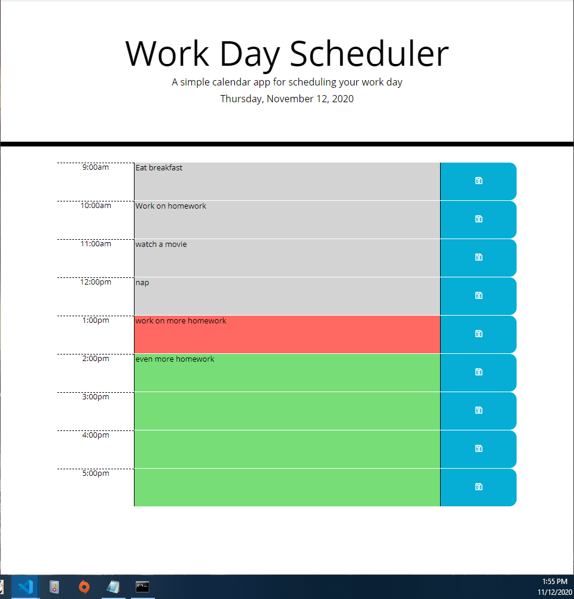

# Work Day Scheduler
```
Live Site: https://jasonmcd96.github.io/Work-Day-Scheduler/
```

## Description

In this project I created a simple scheduling app using the moment.js api. Moment allowed me to calculate what the current time is and wether the different hourly time blocks were before, after, or within the same hour of the current time. Instead of hard coding the the time blocks for the day, they are dynamically generated withing the script file. You can also type in to the different time blocks and save what you typed. For example, you can enter "eat breakfast" for 9am, and click the save button in that row to save the changes for that row.


## Preview

The following animation demonstrates the application functionality:


